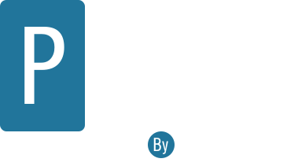

# 📅 Planner 2026

**Planner de contenido anual para redes sociales — offline, multi-marca y sin dependencias de servidor.**

> Una PWA (Progressive Web App) que funciona 100% en el navegador. Sin bases de datos, sin cuentas, sin suscripciones. Todos los datos se guardan localmente en tu dispositivo.

---

## 📋 Tabla de contenidos

- [¿Qué es y para qué sirve?](#-qué-es-y-para-qué-sirve)
- [Características principales](#-características-principales)
- [Estructura de archivos](#-estructura-de-archivos)
- [Cómo instalar y usar](#-cómo-instalar-y-usar)
- [Personalización del Proyecto](#-personalización-del-proyecto)
  - [Personalización: Logos en el header](#-personalización-logos-en-el-header)
  - [Personalización: Unidades (Marcas/Proyectos)](#-personalización-unidades-marcasproyectos)
  - [Personalización: Formatos y sus colores](#-personalización-formatos-y-sus-colores)
  - [Personalización: Redes sociales](#-personalización-redes-sociales)
  - [Personalización: Horarios Sugeridos](#-personalización-horarios-sugeridos)
  - [Personalización: Colores globales del tema](#-personalización-colores-globales-del-tema)
- [Cómo funciona por dentro](#-cómo-funciona-por-dentro)
- [Exportación e importación de datos](#-exportación-e-importación-de-datos)
- [Instalación como app (PWA)](#-instalación-como-app-pwa)
- [Tecnologías utilizadas](#-tecnologías-utilizadas)
- [Licencia](#-licencia)

---

## 🎯 ¿Qué es y para qué sirve?

El **Planner 2026** es una herramienta de planificación de contenido para creadores y equipos que gestionan **múltiples marcas o cuentas en redes sociales**. Permite:

- **Planificar con anticipación**: Ver todo el año 2026 en una sola pantalla, mes por mes.
- **Organizar por marcas**: Cada publicación puede asignarse a una *unidad* (marca, canal o proyecto).
- **Definir el tipo de contenido**: Cada slot tiene un *formato* (Carrusel, Stream, etc.).
- **Registrar en qué redes se publica**: Instagram, TikTok, YouTube Shorts, YouTube, LinkedIn, X.
- **Guardar métricas**: Likes y alcance de cada publicación.
- **Añadir notas**: Comentarios libres por slot.
- **Buscar en todo el calendario**: Encontrá cualquier marca, formato o comentario al instante.
- **Exportar datos**: JSON (backup), CSV (para Excel/Sheets) y PDF (para compartir).

### ¿Qué es un "slot"?
Cada día puede tener uno o más *slots*. Un slot representa una publicación planificada: tiene hora, marca asignada, tipo de contenido, redes donde se publicará y métricas. Por defecto cada día abre con 5 slots vacíos.

---

## ✨ Características principales

| Característica | Descripción |
|---|---|
| 🗓️ Calendario anual | 12 meses visibles simultáneamente, semana empieza el lunes |
| 🎨 Código de colores | Los días sin contenido son grises; con 1-2 slots completos, amarillos; con 3+, verdes |
| 🔍 Búsqueda global | Filtra días por unidad, formato, red o comentario en tiempo real |
| 💾 Persistencia local | Datos guardados en `localStorage`, sin servidor |
| 📤 Export JSON | Backup completo de todos los datos |
| 📥 Import JSON | Restaurar backup o combinar planners |
| 📊 Export CSV | Para abrir en Excel, Google Sheets, etc. |
| 📄 Export PDF | Documento formateado con portada y detalle por día |
| 📸 Captura PNG | Screenshot del modal del día para compartir |
| 📱 PWA | Instalable como app en celular y desktop |
| 🌐 Offline | Funciona sin internet después de la primera carga |
| 📱 Responsive | Adaptado para celular, tablet y desktop |

---

## 📁 Estructura de archivos

```
planner-2026/
│
├── index.html        # Estructura HTML de la app
├── app.js            # Toda la lógica JavaScript
├── styles.css        # Estilos visuales
├── sw.js             # Service Worker (caché offline y PWA)
├── manifest.json     # Configuración de la PWA
│
└── img/              # (carpeta que deberás crear con tus propias imágenes)
    ├── favicon.svg
    ├── logo.svg      # Logo principal del header
```

---

## 🚀 Cómo instalar y usar

### Opción A — Abrir directo en el navegador
1. Cloná o descargá el repositorio.
2. Abrí `index.html` en tu navegador (Chrome o Edge recomendados).
3. Listo. No requiere servidor ni instalación de dependencias.

> ⚠️ **Nota:** Para que la PWA y el Service Worker funcionen correctamente, es recomendable servirlo desde un servidor local o hosting. Podés usar Live Server en VS Code o cualquier servidor estático.

### Opción B — Servidor local rápido (Node.js)
```bash
npx serve .
```

### Opción C — Servidor local rápido (Python)
```bash
python -m http.server 8080
```

---

## 🛠️ Personalización del Proyecto

El **Planner 2026**, desarrollado por @soymarcusdev, está diseñado para ser altamente personalizable. Aquí te explicamos cómo adaptar los elementos clave a tus necesidades.

!Imagen de referencia

### 🖼️ Personalización: Logo en el header

El logo del encabezado es una imagen (SVG, PNG, etc.) ubicada en la carpeta `img/`.

**Archivo:** `/Planner_FREE/index.html` — Buscar el bloque `<div class="logos-title">`

```html
<div class="logos-title">
  
  <!-- Puedes añadir más logos aquí, siguiendo el mismo patrón -->
  <!--  -->
</div>
```

**Para reemplazar los logos:**
1.  Colocá tus propias imágenes en la carpeta `img/`.
2.  Modificá el atributo `src` de cada `` para que apunte a tu archivo.
3.  Actualizá el atributo `alt` con el nombre de tu marca para accesibilidad.

**Para agregar un logo nuevo:**
Añadí una nueva línea `` dentro de `<div class="logos-title">` con la ruta y el `alt` correspondiente.

**Para eliminar un logo**, simplemente borrá la línea `` correspondiente.

**Tamaño de los logos:**
El tamaño se define en `/Planner_FREE/styles.css` — buscar la clase `.logo`:

```css
.logo {
  width: 160px;   /* ← cambiá este valor */
  height: auto;   /* ← o ajustá la altura si es necesario */
}
```

### 🏷️ Personalización: Unidades (Marcas/Proyectos)

Las **unidades** son las marcas, canales o proyectos que gestionás. Aparecen como opciones en el selector "Unidad" de cada slot.

**Archivo:** `/Planner_FREE/app.js` — Líneas 26 a 29 (aproximadamente)

```js
// ANTES (ejemplo original)
const unidades = [
  "Unidad / Objetiivo / Metas"
];
```

**Para modificar, agregar o eliminar unidades**, reemplazá los nombres por los tuyos:

```js
// EJEMPLO personalizado
const unidades = [
  "Mi Marca Principal",
  "Canal de YouTube",
  "Proyecto Personal",
  "Cliente A",
  "Cliente B"
];
```

**Reglas:**
- Podés poner **la cantidad que quieras**.
- Son **texto libre**: usá el nombre que quieras, con tildes y espacios.
- El primer elemento de la lista será el valor por defecto al abrir un nuevo slot.

### 🎨 Personalización: Formatos y sus colores

Los **formatos** son los tipos de contenido que producís. Cada formato tiene un **color de fondo** que colorea el selector en la tabla para identificarlos visualmente de un vistazo.

**Paso 1 — Cambiar la lista de formatos**

**Archivo:** `/app.js` — Líneas 31 a 35 (aproximadamente)

```js
// ANTES (ejemplo original)
const formatos = [
  "Carrusel","Memes","Stream",
  "Green Screen","Vlog","Selfie","Comentarios",
  "Trend", "Podcast", "Proyectos", "Portfolio"
];
```

**Para modificar, agregar o eliminar formatos**, reemplazá los nombres:

```js
// EJEMPLO personalizado
const formatos = [
  "Reels",
  "Historia",
  "Foto",
  "Video Largo",
  "Directo",
  "Newsletter"
];
```

**Paso 2 — Asignar un color a cada formato**

**Archivo:** `/Planner_FREE/styles.css` — Buscar el bloque "FORMATO COLORS" (aproximadamente líneas 225 a 238)

La regla de nomenclatura para el nombre de la clase CSS es:

```
.format-{nombre_en_minúsculas_sin_espacios_ni_guiones}
```

**Ejemplos de cómo se genera el nombre de clase:**
| Nombre en `app.js` | Clase CSS generada |
|---|---|
| `"CapCut"` | `.format-capcut` |
| `"Green Screen"` | `.format-greenscreen` |
| `"Proyectos-IA"` | `.format-proyectos-ia` |
| `"Reels"` | `.format-reels` |

> **⚙️ Cómo se genera:** En `/Planner_FREE/app.js` (línea 316), la función `applyFormatColor` convierte el valor del formato a minúsculas y elimina espacios: `value.toLowerCase().replace(" ", "")`. Los guiones medios **sí se conservan**.

**Bloque de estilos a modificar en `styles.css`:**

```css
/* FORMATO COLORS (VERSIÓN LEGIBLE DARK MODE) */
.format-carrusel     { background: #003049; color: #fff; }
.format-memes        { background: #283618; color: #fff; }
/* ... y así sucesivamente para cada formato ... */
```

**Para agregar un formato nuevo** (por ejemplo, `"Newsletter"`):

1.  Agregá `"Newsletter"` al array `formatos` en `app.js`.
2.  Agregá en `styles.css` una nueva regla CSS:
    ```css
    .format-newsletter { background: #1a6b3a; color: #fff; }
    ```

**Para cambiar el color de un formato existente**, simplemente cambiá el valor hexadecimal de `background` en su respectiva clase CSS.

### 🌐 Personalización: Redes sociales

Las redes disponibles como checkbox en cada slot se definen en `app.js`.

**Archivo:** `/Planner_FREE/app.js` — Línea 37 (aproximadamente)

```js
// ANTES
const redes = ["Instagram","TikTok","Shorts","YouTube","LinkedIn","X"];
```

**Para modificar, agregar o eliminar redes:**
```js
// EJEMPLO personalizado
const redes = ["Instagram","TikTok","YouTube","Pinterest","Threads"];
```

**Cambiar el ícono de cada red:**

**Archivo:** `/Planner_FREE/app.js` — Líneas 263 a 274 (aproximadamente)

```js
function getIconClass(red) {
  const map = {
    "Instagram": "fa-brands fa-instagram",
    "TikTok": "fa-brands fa-tiktok",
    "Shorts": "fa-brands fa-square-youtube",
    "YouTube": "fa-brands fa-youtube",
    "LinkedIn": "fa-brands fa-linkedin",
    "X": "fa-brands fa-x-twitter"
  };
  return map[red] || "fa-solid fa-circle";
}
```

Para agregar una nueva red, añadí una entrada al objeto `map` con la clase de Font Awesome. Ejemplo para Threads:

```js
"Threads": "fa-brands fa-threads",
```

> Si una red no tiene entrada en el `map`, se mostrará un círculo genérico (`fa-solid fa-circle`).

### ⏰ Personalización: Horarios Sugeridos

El **Planner 2026** te ofrece horarios sugeridos para cada slot, facilitando la carga de datos. Puedes modificar estos valores.

**Paso 1 — Modificar los horarios en `app.js`**

**Archivo:** `/Planner_FREE/app.js` — Línea 20 (aproximadamente)

```js
/* Horas sugeridas según índice de slot (auto-fill si vacío) */
const horasSugeridas = ["09:00", "12:00", "15:00", "18:00", "21:00"];
```

Simplemente cambiá los valores dentro del array `horasSugeridas` por los que prefieras.

**Paso 2 — Modificar los horarios en el `datalist` de `index.html` (opcional, para sugerencias visuales)**

**Archivo:** `/Planner_FREE/index.html` — Buscar el bloque `<datalist id="timePresets">`

```html
<datalist id="timePresets">
  <option value="09:00">
  <option value="12:00">
  <option value="15:00">
  <option value="18:00">
  <option value="22:00">
</datalist>
```

Aunque los valores de `app.js` son los que se usan para auto-completar, esta `datalist` proporciona sugerencias visuales en el campo de hora. Es buena práctica mantenerlos sincronizados.

### 🌈 Personalización: Colores globales del tema

Los colores principales de la app se definen como variables CSS al inicio de `/Planner_FREE/styles.css` — Líneas 1 a 5:

```css
:root {
  --bg:     #0f1115;  /* Color de fondo general (negro azulado) */
  --card:   #1a1d24;  /* Color de las tarjetas/meses/modal */
  --text:   #e6e6e6;  /* Color del texto principal */
  --accent: #4f8cff;  /* Color de acento (azul) — botones, foco, badges */
}
```

**Para cambiar el tema de color**, modificá únicamente estas 4 variables y el resto de la app se actualiza automáticamente.

**Ejemplo: Tema verde oscuro**

```css
:root {
  --bg:     #0d1410;
  --card:   #182219;
  --text:   #e0ece2;
  --accent: #3ec97a;
}
```

---

## ⚙️ Cómo funciona por dentro

### Flujo general

```
Usuario hace clic en un día
  → openDay(date)
    → renderTable(key)
      → Lee localStorage ("planner2026")
      → Construye filas con selectHTML() y checkboxHTML()
      → Aplica colores de formato con applyFormatColor()

Cualquier cambio en la tabla
  → saveRow(key)
    → Lee el DOM (selects, inputs, checkboxes, textarea)
    → Guarda el objeto actualizado en localStorage
    → Llama refreshCurrentDay() para actualizar el badge del día
```

### Almacenamiento

Todos los datos viven en `localStorage` bajo la clave `"planner2026"`. La estructura es:

```json
{
  "2026-01-05": [
    {
      "hora": "09:00",
      "unidad": "Soy Marcus",
      "formato": "Reels",
      "redes": ["Instagram", "TikTok"],
      "likes": "1200",
      "alcance": "8500",
      "comentarios": "Post sobre café de especialidad"
    }
  ],
  "2026-01-12": [ ... ]
}
```

Las claves son fechas en formato `YYYY-MM-DD`. Cada valor es un array de slots.

### Sistema de colores del calendario

Cada día del calendario evalúa sus slots para determinar su estado visual:

| Estado | Condición | Apariencia |
|---|---|---|
| Vacío | 0 slots completos | Gris neutro |
| Parcial | 1 o 2 slots completos | Fondo amarillo con borde dorado |
| Completo | 3 o más slots completos | Fondo verde con borde esmeralda |

Un slot se considera **completo** cuando tiene al menos: `unidad` + `formato` + al menos una red social seleccionada.

El número en la esquina superior derecha de cada día (badge) indica la cantidad de slots completos.

### Búsqueda global

La búsqueda recorre **todos los días guardados en localStorage** y compara el término ingresado contra: `unidad`, `formato`, `comentarios` y `redes`. Los días que coinciden se marcan con un outline azul animado; los que no, se atenúan. La búsqueda tiene un debounce de 200ms para no recalcular en cada tecla.

### Service Worker y modo offline

El archivo `sw.js` implementa una estrategia **cache-first**:

1.  Al instalar la app, pre-cachea los archivos core (`index.html`, `app.js`, `styles.css`, `manifest.json`) y los assets de CDN (Font Awesome, html2canvas, jsPDF).
2.  En cada request, primero busca en el caché; si no está, va a la red y guarda la respuesta.
3.  Si no hay red y el usuario pide un documento HTML, sirve `index.html` desde caché.

Esto significa que **después de la primera visita, la app funciona completamente sin internet**.

---

## 💾 Exportación e importación de datos

### JSON (backup completo)
- **Exportar**: Descarga un archivo `.json` con todos los datos de todos los días.
- **Importar**: Al importar, si ya hay datos guardados, te pregunta si querés **reemplazar** (borra todo y carga el archivo) o **combinar** (el archivo importado pisa solo los días en conflicto, el resto se preserva).

### CSV
Exporta una tabla plana compatible con Excel o Google Sheets. Las redes de cada slot se separan con `|`. Incluye BOM para compatibilidad con Excel en Windows.

Columnas: `fecha, hora, unidad, formato, redes, likes, alcance, comentarios`

### PDF
Genera un PDF estructurado con:
- **Portada**: título, fecha de exportación y total de días con contenido
- **Una página por día**: con cada slot en una caja separada mostrando hora, unidad, formato, redes, métricas y primera línea de comentarios

### PNG (captura del modal)
El botón 📸 Capturar dentro del modal toma un screenshot de la tabla del día actual y lo descarga como `planner.png`.

---

## 📱 Instalación como app (PWA)

La app puede instalarse como aplicación nativa en cualquier dispositivo:

- **Android (Chrome)**: Aparece un banner de instalación automáticamente, o ir a Menú → "Añadir a pantalla de inicio"
- **iOS (Safari)**: Tocar el botón Compartir → "Añadir a pantalla de inicio"
- **Desktop (Chrome/Edge)**: Ícono de instalación en la barra de direcciones

Una vez instalada, se abre como una app nativa sin barra del navegador y funciona completamente offline.

---

## 🛠️ Tecnologías utilizadas

| Tecnología | Uso |
|---|---|
| HTML5 + CSS3 + JavaScript vanilla | Toda la app (sin frameworks) |
| `localStorage` | Persistencia de datos |
| Service Worker API | Caché offline y PWA |
| Web App Manifest | Instalación como app nativa |
| Font Awesome 6.5 | Íconos |
| html2canvas 1.4.1 | Captura PNG |
| jsPDF 2.5.1 | Exportación PDF |

---

## 📄 Licencia

Este proyecto es de código abierto. Podés usarlo, modificarlo y distribuirlo libremente. Si lo usás como base para algo propio, se agradece la mención al autor original, @soymarcusdev.

---

*Planner 2026 — hecho con ♥️ por @soymarcusdev para creadores de contenido y mi comunidad*